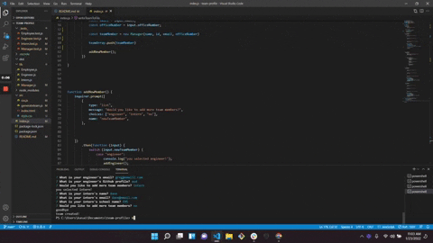

# Team profile generator

## License

## Description

A Node.js application in which the user can create a team profile page for teams that consist of a manager, engineers, and interns.

## Table of contents
* [Description](#description)
* [Usage](#usage)
* [Technologies](#technologies)
* [Preview](#preview)
* [Deployed](#deployed)

## Usage

Type the following command into your terminal to start the application:

node index.js

## Technologies

* JavaScript

* Node.js

## Preview

## Deployed

[Team-profile-generator](https://github.com/kasaipreston/team-profile)

